# MyHealthKit 🤖💊

MyHealthKit is a modular robotic system designed to store, manage, and dispense medicines autonomously.

## Table of Contents
- [Description](#description)
  - [Project Overview](#project-overview)
- [Tools & Dependencies](#tools--dependencies)
  - [Tools](#tools)
  - [Dependencies](#dependencies)
- [Setup & Install](#setup--install)
- [Software](#software)
- [Hardware](#hardware)
  - [Laser Cutting Machine](#laser-cutting-machine)
  - [3D Model](#3d-model)
  - [Components](#components)
  - [Circuit Design](#circuit-design)
- [App Functionalities](#app-functionalities)
- [Amazing Contributions](#amazing-contributions)
- [Demonstration](#demonstration)
- [To Do](#to-do)
- [References](#references)
- [Contributors](#contributors)
- [License](#license)

## Description
---

### Project Overview
MyHealthKit is a modular robotic system designed to store, manage, and dispense medicines autonomously. Built around a Raspberry Pi 4, the robot integrates sensors such as RPLidar for laser-based environment mapping and utilizes ROS Noetic for SLAM and navigation. The physical structure includes laser-cut wood and methacrylate parts, combined with custom-designed 3D-printed components to create a practical and compact storage mechanism.

The accompanying mobile application enhances usability, offering functions like medicine recognition through AI-based image analysis, symptom-based diagnosis suggestions, and medicine inventory management. Users interact seamlessly with the robot via intuitive QR-code-based navigation requests and visual medicine retrieval commands.

The software architecture relies on ROS packages for robust mapping, localization, and path-planning capabilities, enabling autonomous operation even in dynamic indoor environments.

By integrating advanced sensor fusion, intuitive software interfaces, and precision-designed hardware, MyHealthKit provides a reliable medicine management solution tailored for home or clinical environments.

  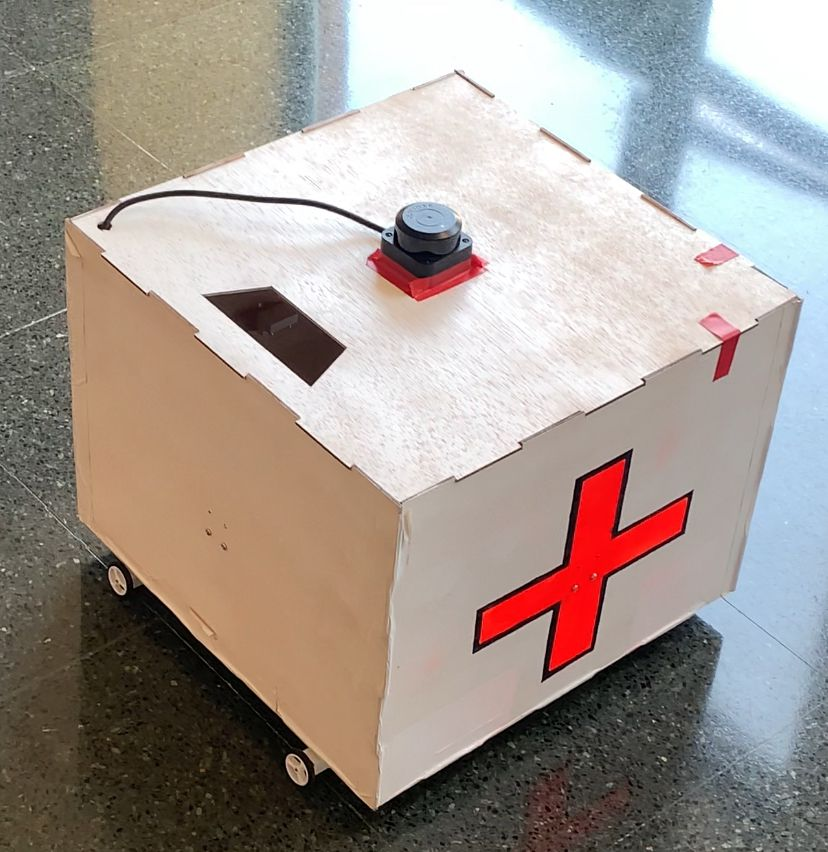

## Tools & Dependencies
---
To fully develop the project, we rely on a set of specific tools and dependencies that help us achieve the expected results.

### Tools
* **[CoppeliaSim](https://www.coppeliarobotics.com/):** For robot simulation.  
* **[Visual Studio Code](https://code.visualstudio.com/):** For robot development with Python.  
* **[RViz](https://wiki.ros.org/rviz):** 3D visualization tool for ROS, useful for viewing robot models, sensor data, and planning information.  
* **[draw.io](https://app.diagrams.net/):** Diagramming tool for designing system architectures, flowcharts, and processes.  
* **[Fritzing](https://fritzing.org/):** Open-source tool for designing and documenting electronics and breadboard layouts.

### Dependencies
##### MyHealthController
- 
- 
- 
- 
- 
- 
- 
- 

##### MyHealthCall
- 
- 
- 

## Setup & Install
---
Download this repository.

git clone https://github.com/aandreu7/MyHealthKit

To run MyHealthCall app, follow these instructions:

- Install Node.js and Expo Go app.
- Go to MyHealthCall/
- Execute npm install in order to install all package.json dependencies.
- Execute npx expo start -c --tunnel
- App will be available on web trough http::/localhost
- To use it on phone, change local phone IP on MyHealthCall/services/sendMessageToRobot.tsx, press C and scan QR code using Expo Go app.

To run MyHealthController (server + hardware drivers), follow these instructions:

- To run server, go to MyHealthController/ and execute:

pip install -r requirements.txt

So as to install all Python dependencies.

- Execute MyHealthController/server/app.py using a Python3 interpreter and server will be running on port 5000 by default.

- Install ROS Noetic. Only available on Ubuntu 20.04 (Docker images are published but only working on Linux devices, not working on Windows/MacOS through Docker Desktop). Follow this tutorial to install and get familiarized with ROS: https://wiki.ros.org/noetic/Installation

- To run SLAM and Navigation, go to MyHealthController/SLAM/catkin_ws and compile it executing:

catkin_make

- Once compiled, run ROS (RPLidar C1 + Hector SLAM + move_base) using our personalized ROS packet and launch file:

roslaunch my_slam_setup myhealthkit.launch

## Software
---
This section explains the software architecture, describing how the robot's modules interact to perform coordinated tasks.

The following scheme illustrates how user can communicate with MyHealthKit through MyHealthCall application. A user can ask for a diagnosis, the list of medicines storaged in the robot, request the presence of the robot, and ask to add and store a new medicine.

The robot, as it runs a server on its controller, responds to each petition while runs SLAM continuously.
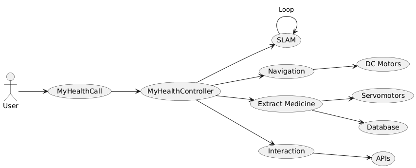

Our project integrates ROS (Noetic), which works using topics and nodes. The following diagram shows how nodes publish data on topics, so other nodes can gather input data and produce and publish new data on output topics.

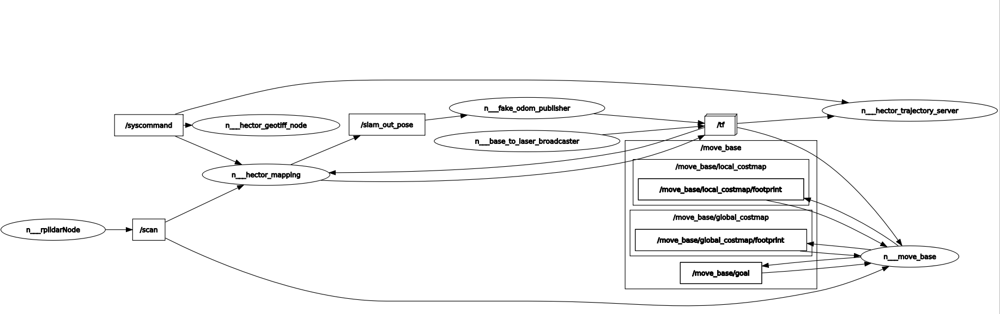

Basically, RPLidar node publishes data on /scan topic, so Hector SLAM, through the implementation of a scan-matching algorithm, can create the map, which is sent to Move Base node, which publishes the velocity at which each wheel should run to get to the goal.

## Hardware
---
In this section, we describe the laser-cut parts, the 3D models used, the components table with prices, and the circuit design of MyHealthKit.

### Laser Cutting Machine
This section shows the laser-cut parts: methacrylate and wood for gears and structural elements.

| Methacrylate            | Image                                                               | Wood              | Image                                                                 |
|----------------------|---------------------------------------------------------------------|-----------------------|-----------------------------------------------------------------------|
|     Big gear            |   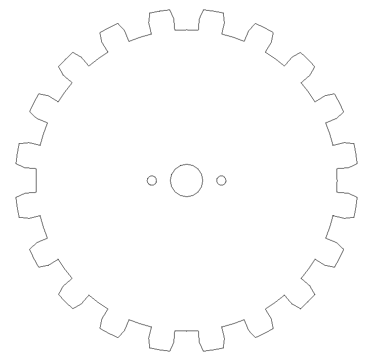              | Box              |   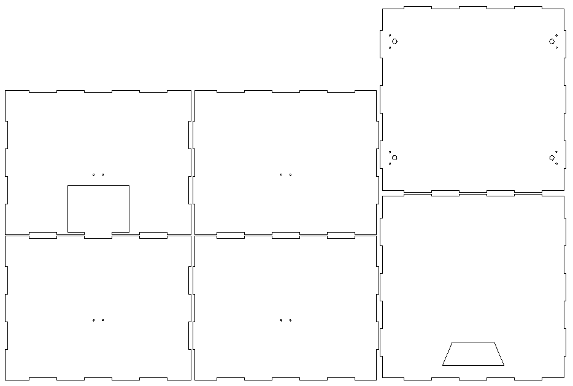    |
| Middle          |   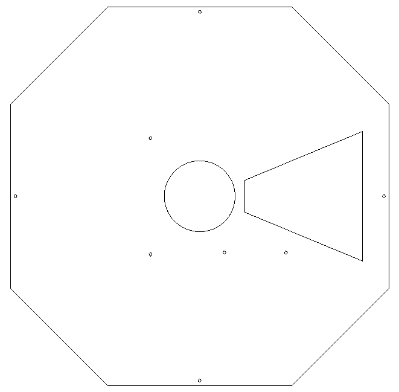         |  Roulette walls |   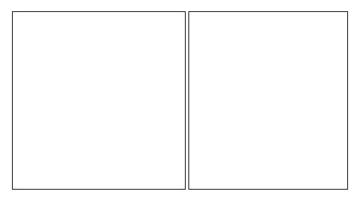         |
| Small gear  |   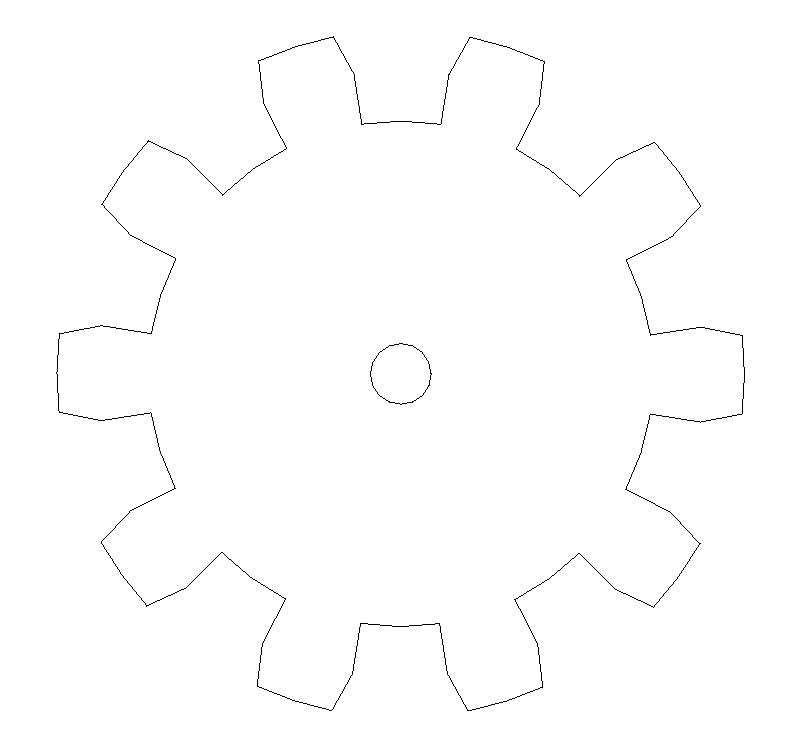           |  | 

### 3D Model
Below we can see the complete structure of the MyHealthKit robot, both from the outside and the inside.

<table style="width:100%; table-layout:fixed;">
  <tr>
    <th style="width:20%;">3D Piece</th>
    <th style="width:30%;">Image</th>
    <th style="width:20%;">3D Piece</th>
    <th style="width:30%;">Image</th>
  </tr>
  <tr>
    <td>Outside</td>
    <td>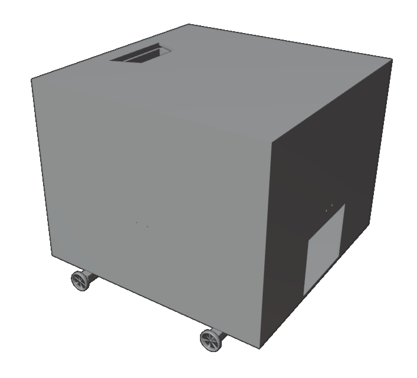</td>
    <td>Inside</td>
    <td>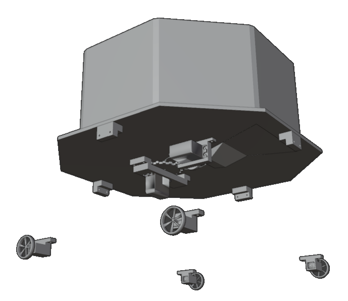</td>
  </tr>
</table>

The following section shows each 3D piece separately.
Each model corresponds to a physical part of the robot that was designed and printed individually for assembly.

| 3D Piece             | Image                                                               | 3D Piece              | Image                                                                 |
|----------------------|---------------------------------------------------------------------|-----------------------|-----------------------------------------------------------------------|
|     Bracket middle            |   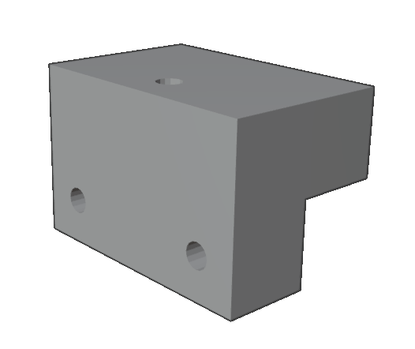              | Bracket n20              |   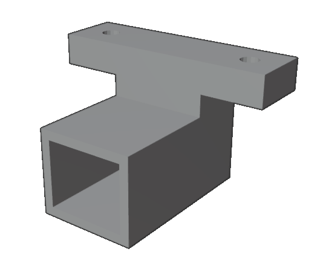    |
| Bracket servo trap door          |   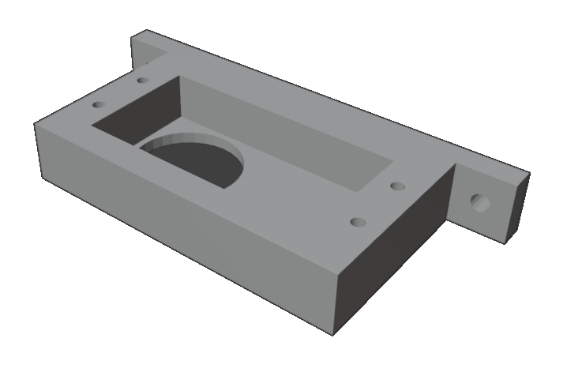         |   Bracket servo roulette |   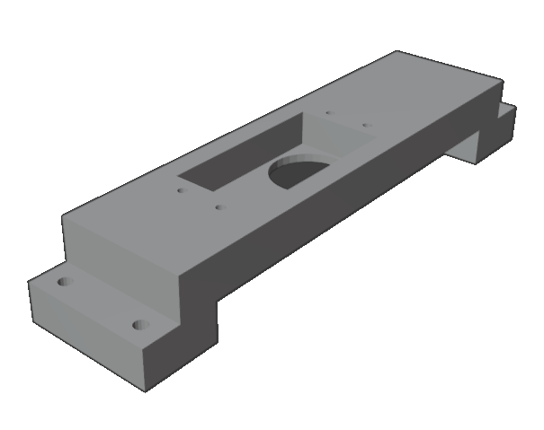         |
| Trap door  |   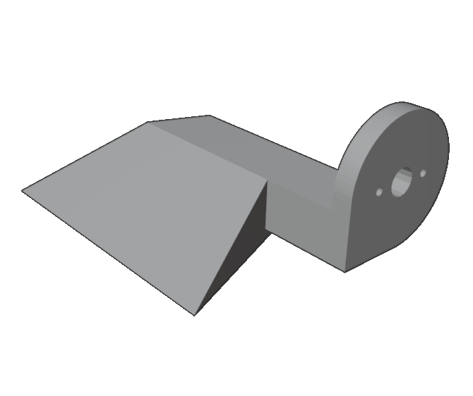           | Roulette |   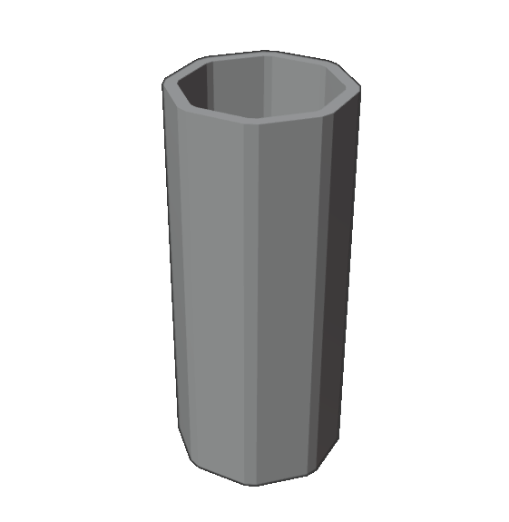                 

### Components
In this section, we provide an overview of the key components 
| **Name**                                          | **Units** | **Total**   |
|--------------------------------------------------|-----------|-------------|
| Raspberry Pi 4 Modelo B 8GB RAM                           | 1         | 89.95€      |
| RPLidar C1                                         | 1         | 96.74€      |
| Controlador motor DC dual DRV8833                            | 2         | 36.18€       |
| Batería Ion Litio 3.7V                                    | 1         | 24.14€      |
| Servomotor MG996R                     | 2         | 15.74€      |
| Mini Motor DC                                          | 4         | 12.12€       |
| Rueda de goma 32x7mm (2 und)                        | 2         | 9.56€      |
| **Total Price**                                   |           | **284.43€** |

### Circuit Design
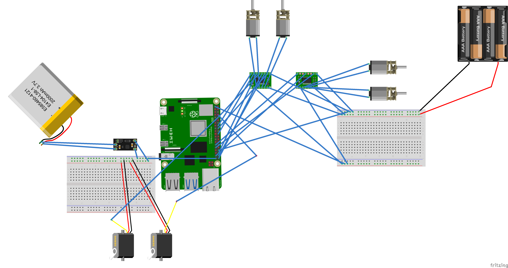

## App Functionalities
---
This section covers the main app features, including direct interaction with the robot.  
**Figure 1** shows the app’s home screen, where all functions can be accessed.

### Add a medicine
This feature lets the user add a new medicine by taking a photo. An AI analyzes the image, saves the data, and the robot assigns a free slot for manual placement.  
**Figure 2** shows the capture interface.

### Get a Diagnosis
The user records their symptoms, and an AI analyzes the audio to suggest a diagnosis and matching medicines. The result is also spoken aloud through the phone.  
**Figure 3** shows an example of a diagnosis result.

### Show Medicines
This option allows the user to see the list of medicines stored in the robot.  
**Figure 4** shows an example with several items.
When selecting a medicine, options appear to retrieve or delete it, as shown in **Figure 5**. The app also provides information about the medicine.
Tapping *Get Medicine* makes the robot locate and release the item, which must later be returned to the same slot.  
Tapping *Delete Medicine* makes the item accessible for manual removal and deletes it from the system.

### Request MyHealthKit
Another functionality available on the Home screen is *Request MyHealthKit*, which lets the user scan a QR code representing a destination. The robot then moves automatically to that location.  
**Figure 6** shows the QR scanning process.

| 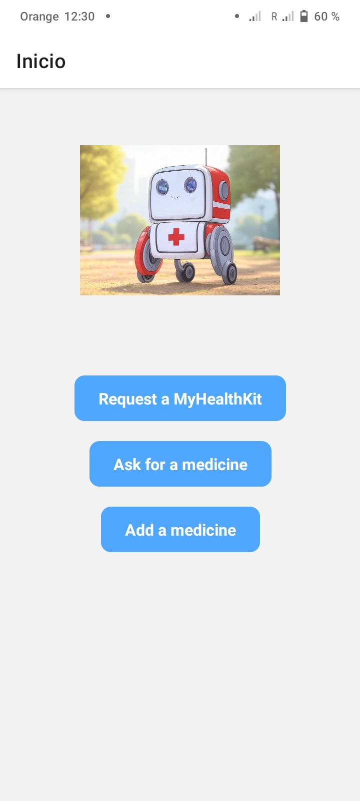 | 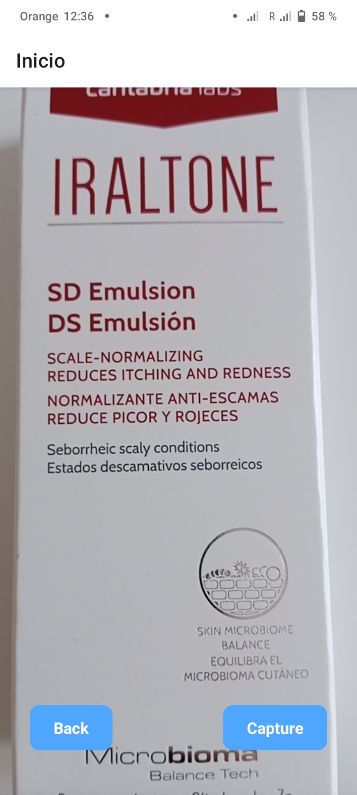 | 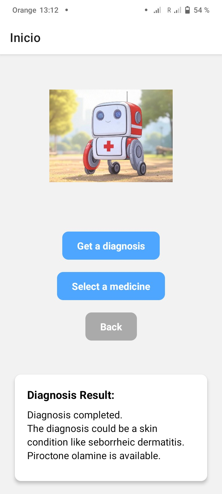 |
|:-------------------------------:|:-------------------------------:|:-------------------------------:|
| **Figura 1. Main screen**       | **Figura 2. Medicine capture**  | **Figura 3. Diagnosis result**  |
| 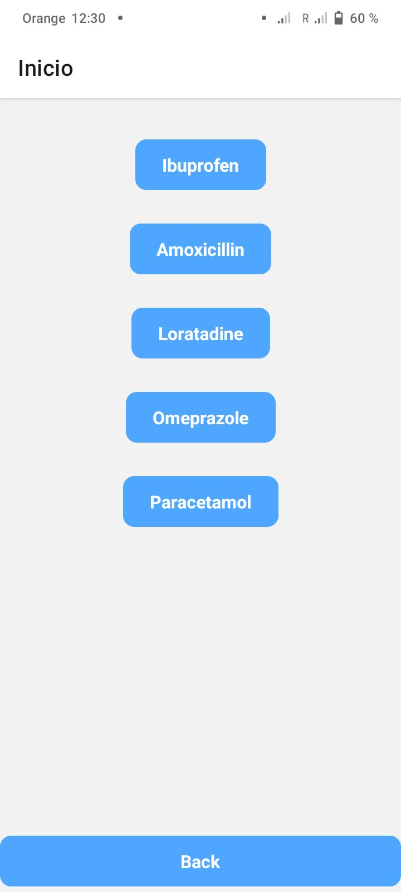 | 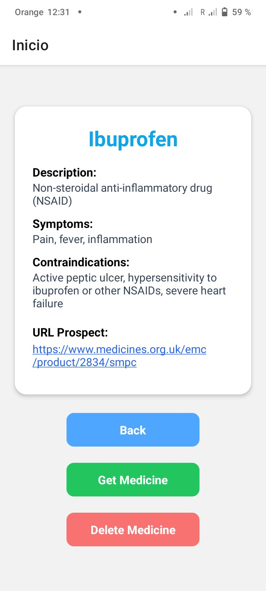 | 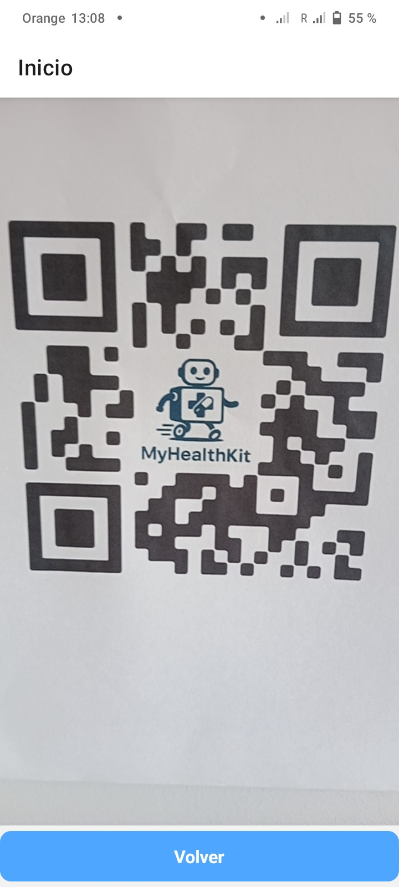|
| **Figura 4. Stored medicines**  | **Figura 5. Details medicine**  | **Figura 6. Scanning QR**     |

## Amazing Contributions
---
- One-click navigation: At any moment, just by scanning a QR code, which can be done with only one click on the app main screen, a MyHealthKit will automatically set sail to your position.

- Fully-integrated medical support: A MyHealthKit cannot only be used to store and deploy medicines, but also serves as a server able and prepared to respond to medical-related questions, give medical advices and diagnosis using a fine-tunned LLM model through MyHealthCall app.

## Demonstration
---
[Link to visual demonstration](https://youtu.be/2AqkAf-FRpg)

## To Do
---
- **Improved App-Robot Communication** Use WebSocket or MQTT instead of HTTP to enable real-time communication, lower latency, and better handling of asynchronous events like alerts or confirmations.

- **Enhanced App Interactivity** Add features that let users track if they took their medicine, mark follow-up days, and receive reminders, improving treatment adherence and user engagement.

## References
---
- i. React. (n.d.). *React documentation*. Retrieved June 26, 2025, from https://react.dev/
- ii. Hector SLAM. *Code and documentation*. Retrieved June 26, 2025, from https://wiki.ros.org/hector_slam
- iii. OpenAI. (n.d.). *API reference and model documentation*. Retrieved June 26, 2025, from https://platform.openai.com/docs
- iv. Together AI. (n.d.). *Together AI - Cloud inference and open models*. Retrieved June 26, 2025, from https://www.together.ai/

## Contributors
---
- **Zakaria Boudich Makran** - Universitat Autònoma de Barcelona (UAB)
- **Damià Turu Pérez** - Universitat Autònoma de Barcelona (UAB)
- **Andreu Plana Joya** - Universitat Autònoma de Barcelona (UAB)
- **Oussama Berrouhou Barrouhou** - Universitat Autònoma de Barcelona (UAB)
- **Èric Rodríguez de Sande** - Universitat Autònoma de Barcelona (UAB)

## License
---
This project is licensed under the [Apache-2.0 License](https://github.com/aandreu7/MyHealthKit/blob/main/LICENSE).

